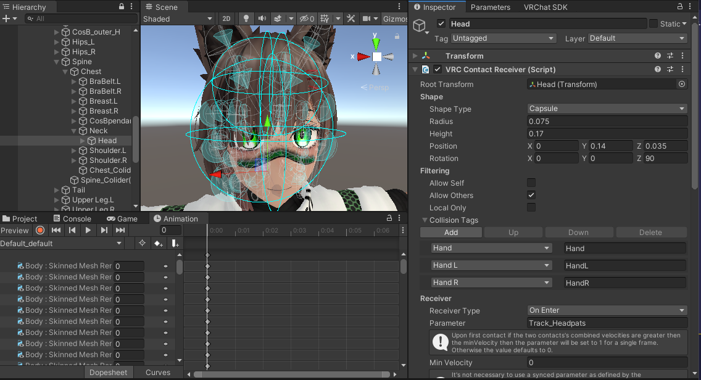
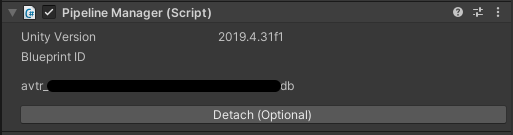
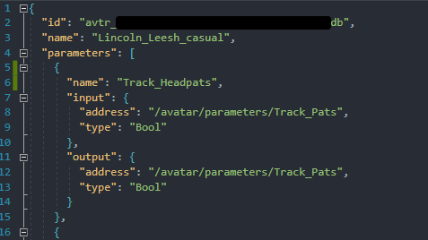
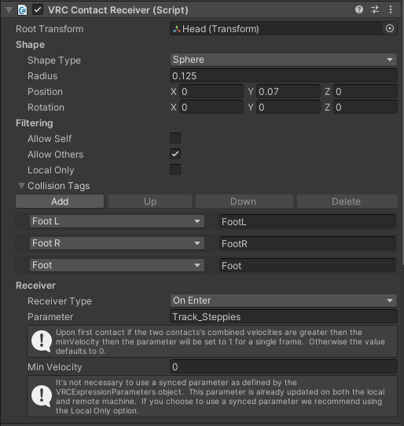
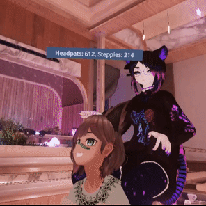
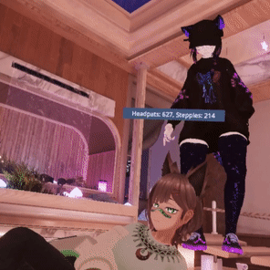

# VRChat Headpat+ Counter

### <b>[How To Setup](#How-To-Setup) | [Customize Your Parameters](#Customize-Your-Parameters) | [See It In Action](#See-It-In-Action)</b>  

## <b>What is this? </b> 

### <b><i>A dynamic counter for VRChat. This script uses parameters setup inside VRC Contact Receivers. It will track and temporarily display set properties into VRC's chatbox each time one of those properties is incremented.</b></i>

 

## <b>How To Setup</b>

> ### <b>[Unity Setup](#Unity-Setup) -> [OCS Parameters Setup](#OSC-Parameters-Setup) -> [Launching This Program](#Launching-Program)</b>

 

## <b>Unit Setup</b>

---

    1. Add a `VRC Contact Receiver` component to your avatar.
    2. Checkmark `Allow Others` inside the `VRC Contact Receiver`
    3. Set the Parameter you would like to track in the `Parameter` field of `VRC Contact Receiver`. This must be named with a `Track_` before the parameter name in order to work with this script (see example below).
    4. Add which collisions you want to trigger the increment of the parameter inside the `VRC Contact Receiver`.

### Example of adding Headpats as a Parameter:

> Note: that in the above example the collider has been attached to my head and the `Track_Headpats` parameter will only triger when a `Hand`, `HandL`, or `HandR` enter that collider. 
> You can [Add any parameter](#Customize-Your-Parameters) that you want. It does not need to be headpats. See the example [Steppies setup](#Customize-Your-Parameters)

 

## <b>OSC Parameters Setup</b>

---

Your avatar will need the put your new parameters into your VRC OSC file. The file can be found in a path such as `C:\Users\your_user_name\AppData\LocalLow\VRChat\VRChat\OSC\your_user_id\Avatars` Each avatar has automatically created files for OSC parameters when it is first loaded. The files are named using that avatars ID. If this is not your first time building the avatar you will either need to:

> ## Do <b>ONE</b> of the two:

### <b>Option 1 -></b> Manually add the parameters in the avatars OSC file.

### <b>Option 2 -></b> Delete the OSC file associated with that avatar so that it will automatically generate a new one when you next load your avatar in game.

 

> Note: you can find your avatars ID inside the `Pipeline Manager(Script)` component in Unity.
> 

### Example of maunally adding the Headpats parameter:

 

## <b>Launching This Program</b>

---

- ## [Download Python](https://www.python.org/downloads/)
- ## Download this Github Repo as Zip
- ## Extract Zip
- ## Run `launch.bat`

 

## <b>Customize Your Parameters</b>

---

This script is not limited to Headpats or just one parameter at a time! You can have multiple trackers setup at once. In the ["See It In Action"](#See-It-In-Action) section I have both `Headpats`, and `Steppies` setup on my avatar. You can easily add many more. The only limitation would come from the character limit inside VRC's chatbox.

Each Parameter will need its own `VRC Contact Receiver` and remember to name each parameter starting with `Track_`. So for steppies it is `Track_Steppies`.

> ### Example Setup of Steppies Counter:
>
>  >  
> In this example I have named my parameter `Track_Steppies` and have set the collision to react to `Foot`, `FootR`, and `FootL`

 

## <b>See It In Action</b>

---

