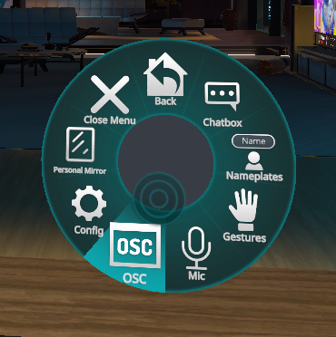
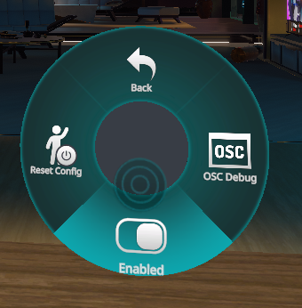
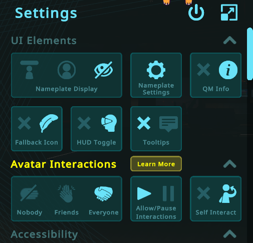

# VRChat Headpat+ Counter

### <b>[How To Setup](#How-To-Setup) | [Customize Your Parameters](#Customize-Your-Parameters) | [Troubleshooting](#Troubleshooting)

## <b>What is this? </b> 

### <b><i>A dynamic counter for VRChat. This script uses parameters setup inside VRC Contact Receivers. It will track and temporarily display set properties into VRC's chatbox each time one of those properties is incremented.</b></i>

## <b>How To Setup</b>

> ### <b>[Unity Setup](#Unity-Setup) -> [OCS Parameters Setup](#OSC-Parameters-Setup) -> [Launching This Program](#Launching-Program)</b>

## <b>Unit Setup</b>

1. Add a `VRC Contact Receiver` component to your avatar.
2. Checkmark `Allow Others` inside the `VRC Contact Receiver`
3. Set the Parameter you would like to track in the `Parameter` field of `VRC Contact Receiver`. This must be named with a `Track_` before the parameter name in order to work with this script (see example below). The parameter must also be a boolean. 
4. Add which collisions you want to trigger the increment of the parameter inside the `VRC Contact Receiver`.

#### Example of adding Headpats as a Parameter:

> Note: that in the above example the collider has been attached to my head and the `Track_Headpats` parameter will only triger when a `Hand`, `HandL`, or `HandR` enter that collider. 
> You can [Add any parameter](#Customize-Your-Parameters) that you want. It does not need to be headpats. See the example [Steppies setup](#Customize-Your-Parameters)

 

## <b>OSC Parameters Setup</b>

> <b> :warning: You can skip this step if you have never enabled OSC in game before as the Avatar folder will be empty and your OSC Avatar JSON files will be auto generated after you enable OSC in game. </b>

Your avatar will need your new parameters put into it's VRC OSC file. The file can be found in a path such as `C:\Users\your_user_name\AppData\LocalLow\VRChat\VRChat\OSC\your_user_id\Avatars` Each avatar has automatically created files for OSC parameters when it is first loaded so long as OSC has been enabled in game. The files are named using that avatars ID. If you have enabled OSC in the past and have loaded into the avatar before putting in your custom tracker parameters you will then need to do one of the two options:

<b>Option 1 -></b> Manually add the parameters in the avatars OSC file. 
<b>Option 2 -></b> Delete the OSC file associated with that avatar so that it will automatically generate a new one when you next load your avatar in game.

 

> Note: you can find your avatars ID inside the `Pipeline Manager(Script)` component in Unity.
> 

#### Example of maunally adding the Headpats parameter:

 

## <b>Launching This Program</b>

1. [Download Python](https://www.python.org/downloads/)
2. Download this Github Repo as Zip
3. Extract Zip
4. Run `launch.bat`
5. In game ensure that OSC has been toggled on (inside your radial menu), and that you have Avatar interactions enabled. 

## <b>Customize Your Parameters</b>

This script is not limited to Headpats or just one parameter at a time! You can have multiple trackers setup at once. Under ["What is this?"](#What-Is-This) I have both `Headpats`, and `Steppies` setup on my avatar. You can easily add many more. The only limitation would come from the character limit inside VRC's chatbox.

Each Parameter will need its own `VRC Contact Receiver` and remember to name each parameter starting with `Track_`. So for steppies it is `Track_Steppies`.

> ### Example Setup of Steppies Counter:

>   
> In this example I have named my parameter `Track_Steppies` and have set the collision to react to `Foot`, `FootR`, and `FootL`

## <b>Troubleshooting</b>

Program not working as expected? This may be a helpful checklist.

- Does your named parameter(s) start with `Track_`
- Did you set the parameter(s) in the [Avatars OCS file](#-Parameters-Setup-Parameters-Setup) found in a path like `C:\Users\your_user_name\AppData\LocalLow\VRChat\VRChat\OSC\your_user_id\Avatars`
- <b>In Game:</b> Did you turn on OSC (Inside the radial menu)?
  
  
  
  
- <b>In Game:</b> Do you have interactions turned on?
  
  
