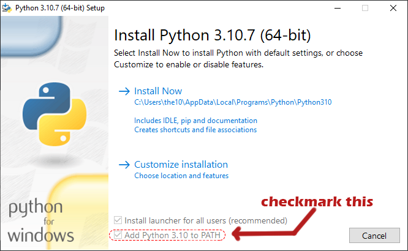
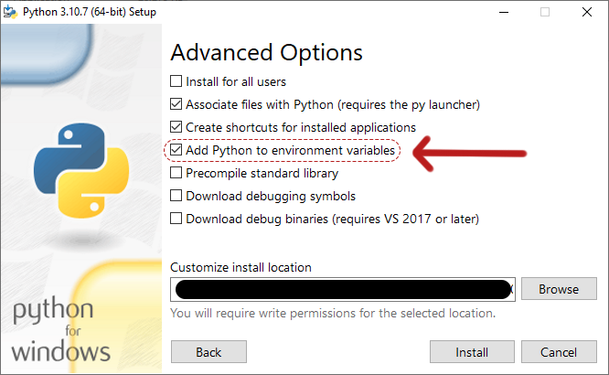

# Installing Python

You can install from the [Python website](https://www.python.org/downloads/)

When downloading directly from Pythons website be sure to add it to PATH, and click "Add Python to environment variables" Under Customize Install -> Advanced Options (See below)

Alternately I have heard some people have success with downloading from the [Microsoft Store](https://apps.microsoft.com/store/search?hl=en-us&gl=us&publisher=Python%20Software%20Foundation), but have not tested this myself.
